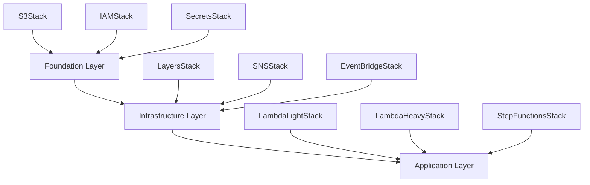
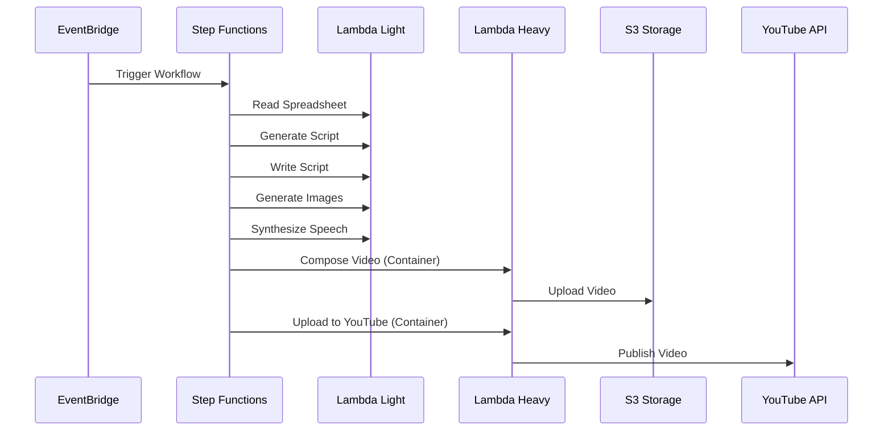

# YouTube 自動動画生成システム - 改善版設計書

## 📋 改善版プロジェクト概要

### 前回の問題を解決した新しいアーキテクチャ

この文書は、前回のデプロイ失敗を分析し、循環依存、リソース名重複、Container Image Lambda の制約などの問題を解決する改善されたアーキテクチャを提供します。

## 🎯 設計目標

1. **安定性**: 循環依存を排除し、確実なデプロイを実現
2. **保守性**: 責任分担を明確にし、独立したスタック管理
3. **スケーラビリティ**: Container Image Lambda を活用した重い処理の対応
4. **コスト効率**: 適切なリソース配分とサイズ最適化

## 🏗️ システムアーキテクチャ

### 階層構造



### 処理フロー



## 📦 スタック詳細設計

### Foundation Layer

#### S3Stack (`foundation/s3-stack.ts`)
```typescript
export class S3Stack extends Stack {
  public readonly bucket: s3.Bucket;
  
  constructor(scope: Construct, id: string, props: S3StackProps) {
    // 命名規則: videogen-assets-{stage}-{account}
    this.bucket = new s3.Bucket(this, 'VideoGenAssets', {
      bucketName: `videogen-assets-${props.stage}-${this.account}`,
      encryption: s3.BucketEncryption.S3_MANAGED,
      // その他設定...
    });
  }
}
```

#### IAMStack (`foundation/iam-stack.ts`)
```typescript
export class IAMStack extends Stack {
  public readonly lambdaLightRole: iam.Role;
  public readonly lambdaHeavyRole: iam.Role;
  public readonly stepFunctionsRole: iam.Role;
  
  constructor(scope: Construct, id: string, props: IAMStackProps) {
    // 全てのIAMロールを事前定義
    this.lambdaLightRole = new iam.Role(this, 'LambdaLightRole', {
      roleName: `VideoGen-LambdaLight-Role-${props.stage}`,
      // ポリシー定義...
    });
    
    this.lambdaHeavyRole = new iam.Role(this, 'LambdaHeavyRole', {
      roleName: `VideoGen-LambdaHeavy-Role-${props.stage}`,
      // Container Image Lambda 用ポリシー...
    });
    
    this.stepFunctionsRole = new iam.Role(this, 'StepFunctionsRole', {
      roleName: `VideoGen-StepFunctions-Role-${props.stage}`,
      // Step Functions 用ポリシー...
    });
  }
}
```

#### SecretsStack (`foundation/secrets-stack.ts`)
```typescript
export class SecretsStack extends Stack {
  public readonly openAiSecret: secretsmanager.Secret;
  public readonly youtubeSecret: secretsmanager.Secret;
  public readonly googleSecret: secretsmanager.Secret;
  
  constructor(scope: Construct, id: string, props: SecretsStackProps) {
    this.openAiSecret = new secretsmanager.Secret(this, 'OpenAISecret', {
      secretName: `videogen/openai-${props.stage}`,
      description: 'OpenAI API credentials',
    });
    
    this.youtubeSecret = new secretsmanager.Secret(this, 'YouTubeSecret', {
      secretName: `videogen/youtube-${props.stage}`,
      description: 'YouTube API OAuth credentials',
    });
    
    this.googleSecret = new secretsmanager.Secret(this, 'GoogleSecret', {
      secretName: `videogen/google-${props.stage}`,
      description: 'Google Sheets API credentials',
    });
  }
}
```

### Infrastructure Layer

#### LayersStack (`infrastructure/layers-stack.ts`)
```typescript
export class LayersStack extends Stack {
  public readonly commonLayer: lambda.LayerVersion;
  public readonly ffmpegLayer: lambda.LayerVersion;
  public readonly googleApisLayer: lambda.LayerVersion;
  
  constructor(scope: Construct, id: string, props: LayersStackProps) {
    this.commonLayer = new lambda.LayerVersion(this, 'CommonLayer', {
      layerVersionName: `videogen-common-${props.stage}`,
      code: lambda.Code.fromAsset(path.join(__dirname, '../../layers/common')),
      compatibleRuntimes: [lambda.Runtime.NODEJS_18_X],
      compatibleArchitectures: [lambda.Architecture.ARM_64],
    });
    
    // FFmpeg Layer for ARM64
    this.ffmpegLayer = new lambda.LayerVersion(this, 'FFmpegLayer', {
      layerVersionName: `videogen-ffmpeg-${props.stage}`,
      code: lambda.Code.fromAsset(path.join(__dirname, '../../layers/ffmpeg-arm64')),
      compatibleArchitectures: [lambda.Architecture.ARM_64],
    });
  }
}
```

### Application Layer

#### LambdaLightStack (`application/lambda-light-stack.ts`)
```typescript
export class LambdaLightStack extends Stack {
  public readonly functions: LightLambdaFunctions;
  
  constructor(scope: Construct, id: string, props: LambdaLightStackProps) {
    // IAMロールを外部から参照
    const executionRole = iam.Role.fromRoleArn(
      this, 'ExecutionRole', 
      props.iamStack.lambdaLightRole.roleArn
    );
    
    this.functions = {
      readSpreadsheetFunction: new lambda.Function(this, 'ReadSpreadsheetFunction', {
        functionName: `videogen-read-spreadsheet-${props.stage}`,
        runtime: lambda.Runtime.NODEJS_18_X,
        architecture: lambda.Architecture.ARM_64,
        handler: 'dist/index.handler',
        code: lambda.Code.fromAsset(path.join(__dirname, '../../src/ReadSpreadsheetFunction')),
        role: executionRole,
        timeout: cdk.Duration.minutes(5),
        memorySize: 512,
        layers: [props.layersStack.commonLayer, props.layersStack.googleApisLayer],
      }),
      // 他の軽量関数...
    };
  }
}
```

#### LambdaHeavyStack (`application/lambda-heavy-stack.ts`)
```typescript
export class LambdaHeavyStack extends Stack {
  public readonly functions: HeavyLambdaFunctions;
  
  constructor(scope: Construct, id: string, props: LambdaHeavyStackProps) {
    // IAMロールを外部から参照
    const executionRole = iam.Role.fromRoleArn(
      this, 'ExecutionRole', 
      props.iamStack.lambdaHeavyRole.roleArn
    );
    
    this.functions = {
      composeVideoFunction: new lambda.DockerImageFunction(this, 'ComposeVideoFunction', {
        functionName: `videogen-compose-video-${props.stage}`,
        code: lambda.DockerImageCode.fromImageAsset(
          path.join(__dirname, '../../src/ComposeVideoFunction')
        ),
        role: executionRole,
        timeout: cdk.Duration.minutes(15),
        memorySize: 3008, // Container Image Lambda の最大値
        architecture: lambda.Architecture.ARM_64,
      }),
      
      uploadToYouTubeFunction: new lambda.DockerImageFunction(this, 'UploadToYouTubeFunction', {
        functionName: `videogen-upload-youtube-${props.stage}`,
        code: lambda.DockerImageCode.fromImageAsset(
          path.join(__dirname, '../../src/UploadToYouTubeFunction')
        ),
        role: executionRole,
        timeout: cdk.Duration.minutes(15),
        memorySize: 2048, // YouTube upload に適したサイズ
        architecture: lambda.Architecture.ARM_64,
      }),
    };
  }
}
```

## 🔧 Container Image Lambda 設定

### Dockerfile 最適化

#### ComposeVideoFunction/Dockerfile
```dockerfile
# ARM64 Lambda base image
FROM public.ecr.aws/lambda/nodejs:18-arm64

# Install FFmpeg for ARM64
RUN yum update -y && \
    yum install -y wget tar xz && \
    wget https://johnvansickle.com/ffmpeg/releases/ffmpeg-release-arm64-static.tar.xz && \
    tar -xf ffmpeg-release-arm64-static.tar.xz && \
    mv ffmpeg-*-arm64-static/ffmpeg /usr/local/bin/ && \
    mv ffmpeg-*-arm64-static/ffprobe /usr/local/bin/ && \
    chmod +x /usr/local/bin/ffmpeg /usr/local/bin/ffprobe && \
    rm -rf ffmpeg-*

# Copy package.json and install dependencies
COPY package*.json ./
RUN npm ci --only=production

# Copy source code
COPY dist/ ./

# Set the CMD to your handler
CMD [ "index.handler" ]
```

### package.json 最適化

```json
{
  "name": "compose-video-function",
  "version": "1.0.0",
  "dependencies": {
    "@aws-sdk/client-s3": "^3.826.0",
    "@aws-sdk/client-secrets-manager": "^3.826.0",
    "@aws-sdk/client-sns": "^3.826.0"
  },
  "devDependencies": {
    "@types/node": "^18.0.0",
    "typescript": "^5.0.0"
  }
}
```

## 📋 デプロイ戦略

### 段階的デプロイ

#### deploy-foundation.ts
```typescript
const app = new cdk.App();
const stage = app.node.tryGetContext('stage') || 'dev';

// Foundation Layer
const s3Stack = new S3Stack(app, `VideoGen-S3-${stage}`, { stage });
const iamStack = new IAMStack(app, `VideoGen-IAM-${stage}`, { stage });
const secretsStack = new SecretsStack(app, `VideoGen-Secrets-${stage}`, { stage });

// Dependencies
iamStack.addDependency(s3Stack);
secretsStack.addDependency(iamStack);
```

#### deploy-infrastructure.ts
```typescript
// Infrastructure Layer
const layersStack = new LayersStack(app, `VideoGen-Layers-${stage}`, {
  stage,
  s3Stack,
});

const snsStack = new SNSStack(app, `VideoGen-SNS-${stage}`, {
  stage,
  iamStack,
});

const eventsStack = new EventBridgeStack(app, `VideoGen-Events-${stage}`, {
  stage,
  iamStack,
});
```

#### deploy-application.ts
```typescript
// Application Layer
const lambdaLightStack = new LambdaLightStack(app, `VideoGen-LambdaLight-${stage}`, {
  stage,
  s3Stack,
  iamStack,
  layersStack,
  secretsStack,
});

const lambdaHeavyStack = new LambdaHeavyStack(app, `VideoGen-LambdaHeavy-${stage}`, {
  stage,
  s3Stack,
  iamStack,
  layersStack,
  secretsStack,
});

const stepFunctionsStack = new StepFunctionsStack(app, `VideoGen-StepFunctions-${stage}`, {
  stage,
  iamStack,
  lambdaLightStack,
  lambdaHeavyStack,
});
```

## 🚀 デプロイコマンド

### Foundation 層のデプロイ
```bash
# Stage 1: Foundation
cd infrastructure
npm run build
cdk deploy VideoGen-S3-dev --require-approval never
cdk deploy VideoGen-IAM-dev --require-approval never
cdk deploy VideoGen-Secrets-dev --require-approval never
```

### Infrastructure 層のデプロイ
```bash
# Stage 2: Infrastructure  
cdk deploy VideoGen-Layers-dev --require-approval never
cdk deploy VideoGen-SNS-dev --require-approval never
cdk deploy VideoGen-Events-dev --require-approval never
```

### Application 層のデプロイ
```bash
# Stage 3: Application
cdk deploy VideoGen-LambdaLight-dev --require-approval never
cdk deploy VideoGen-LambdaHeavy-dev --require-approval never
cdk deploy VideoGen-StepFunctions-dev --require-approval never
```

## 🔍 検証とテスト

### デプロイ後の確認

1. **スタック状態確認**
   ```bash
   aws cloudformation list-stacks --query "StackSummaries[?contains(StackName,'VideoGen')].{Name:StackName,Status:StackStatus}"
   ```

2. **Lambda 関数確認**
   ```bash
   aws lambda list-functions --query "Functions[?contains(FunctionName,'videogen')].{Name:FunctionName,Runtime:Runtime,Architecture:Architectures[0]}"
   ```

3. **Container Image 関数確認**
   ```bash
   aws lambda get-function --function-name videogen-compose-video-dev
   aws lambda get-function --function-name videogen-upload-youtube-dev
   ```

### 動作テスト

1. **Step Functions 手動実行**
   ```bash
   aws stepfunctions start-execution \
     --state-machine-arn $(aws stepfunctions list-state-machines --query "stateMachines[?contains(name,'videogen')].stateMachineArn" --output text) \
     --input '{"source":"manual","stage":"dev"}'
   ```

2. **EventBridge 手動トリガー**
   ```bash
   aws events put-events \
     --entries '[{
       "Source": "videogen.manual",
       "DetailType": "Manual Trigger",
       "Detail": "{\"stage\":\"dev\"}"
     }]'
   ```

## 📊 監視とアラート

### CloudWatch ダッシュボード

```typescript
new cloudwatch.Dashboard(this, 'VideoGenDashboard', {
  dashboardName: `videogen-dashboard-${stage}`,
  widgets: [
    [
      new cloudwatch.GraphWidget({
        title: 'Lambda Duration',
        left: [
          this.composeVideoFunction.metricDuration(),
          this.uploadToYouTubeFunction.metricDuration(),
        ],
      }),
    ],
    [
      new cloudwatch.GraphWidget({
        title: 'Lambda Errors',
        left: [
          this.composeVideoFunction.metricErrors(),
          this.uploadToYouTubeFunction.metricErrors(),
        ],
      }),
    ],
  ],
});
```

### アラーム設定

```typescript
new cloudwatch.Alarm(this, 'ComposeVideoErrors', {
  metric: this.composeVideoFunction.metricErrors(),
  threshold: 1,
  evaluationPeriods: 1,
  alarmDescription: 'ComposeVideo function errors',
});
```

## 💰 コスト最適化

### Container Image サイズ最適化

1. **Multi-stage build**
2. **不要なパッケージの除去**
3. **ARM64 ネイティブイメージの使用**

### Lambda 実行時間最適化

1. **適切なメモリサイズ設定**
2. **不要な依存関係の除去**
3. **効率的なアルゴリズムの実装**

---

**次のステップ**: この設計に基づいて、Foundation Layer から順次実装を開始します。
